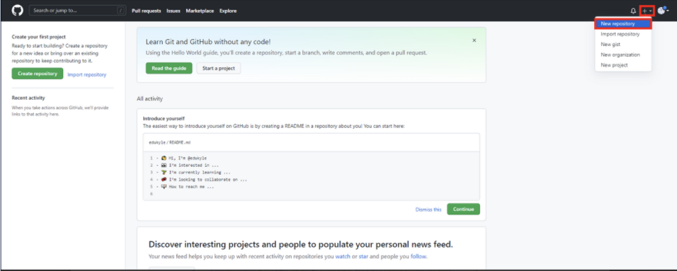
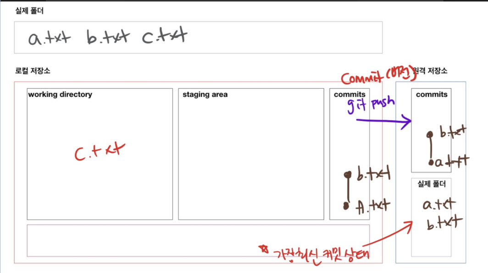
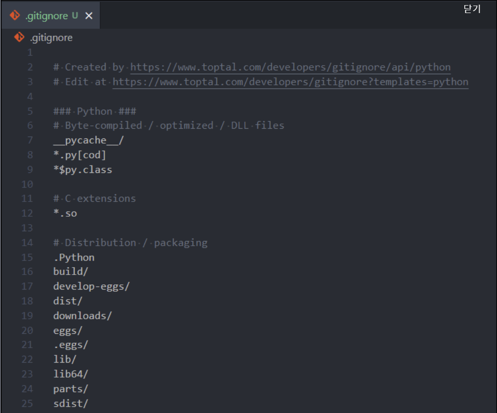
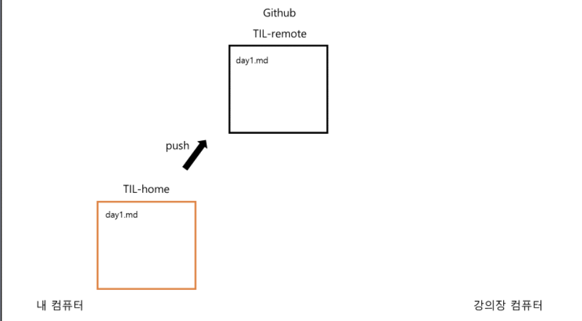
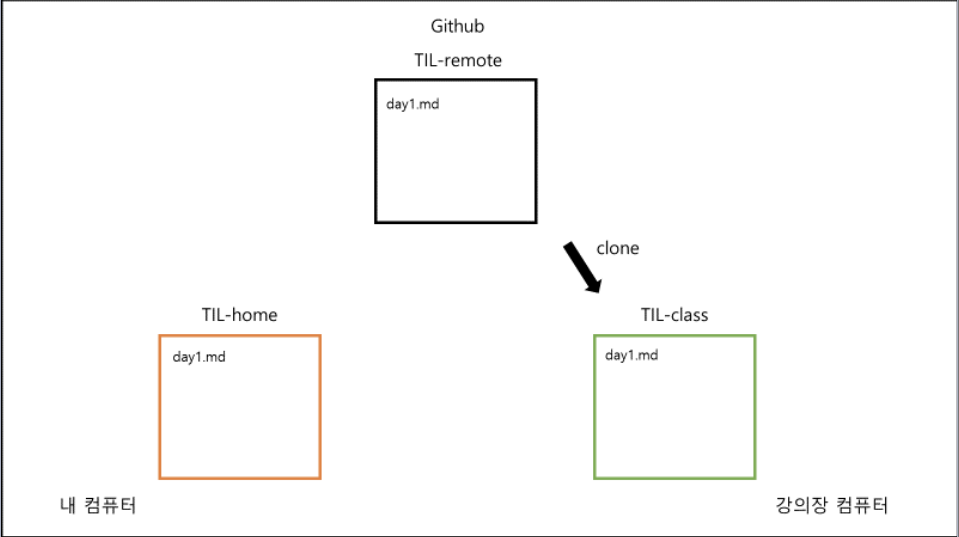
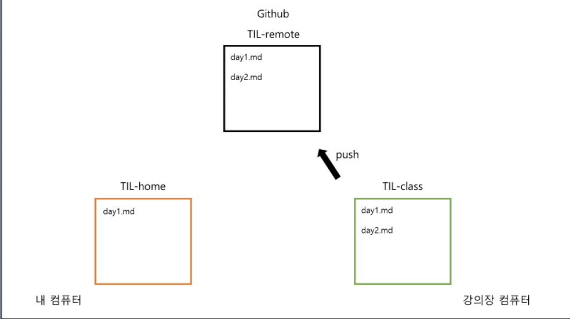
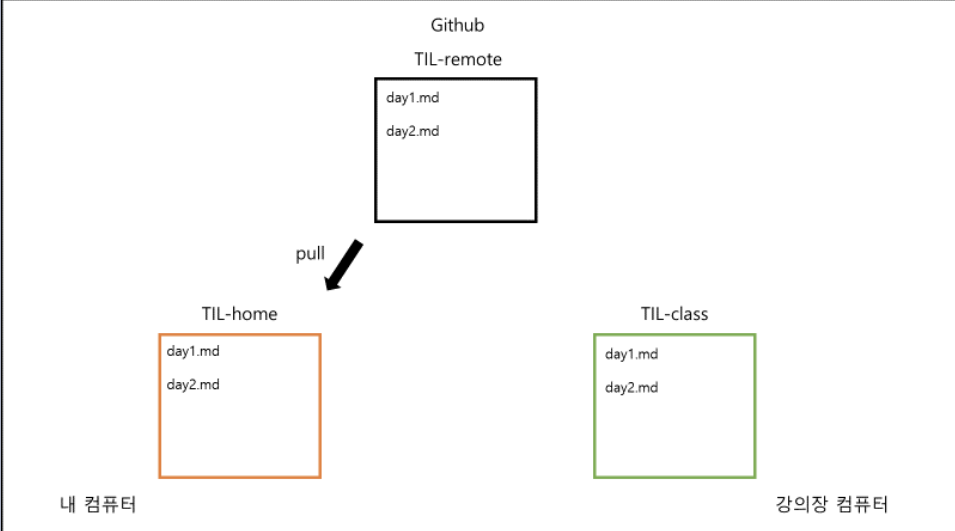

# 2022.02.24 Git hub 특강
## 5) Github
---
## [1] Github 가입하기

### (1) 회원 가입

[깃허브 회원가입](https://goddaehee.tistory.com/218)

### (2) Github 설정 변경


1.  오른쪽 상단 프로필을 클릭합니다.

2. `settings`를 클릭합니다.

3. 왼쪽 안내 바에서 `Repositories`를 선택합니다.

4. `Repository default branch`의 입력창에서 `main`을 지우고 `master`로 작성합니다.

   > 인종차별 이슈로 master대신 main으로 바뀌었지만, 수업 진행 편의상 master 브랜치를 사용하도록 하겠습니다.

5. `update`를 클릭합니다.

### [2] 원격저장소(Remote Repository)
1.  여태까지는 내 컴퓨터라는 한정된 공간에 있는 로컬 저장소에서만 버전 관리를 진행했습니다.
2. 이제는 Gitnub의 원격저장소를 이용해 내 컴퓨터의 로컬 저장소를 다른 사람과 `공유`해 봅시다.
3. Github의 주요 목적 중 하나인 `협업`을 위해 로컬 저장소와 원격 저장소의 연동방법을 학습합니다.

### (1) Github에서 원격 저장소 생성

1. 화면 오른쪽 상단 더하기(+) 버튼을 누르고 New Repository를 클릭합니다.
2. 저장소의 이름, 설명, 공개여부를 선택하고 create repository를 클릭합니다
> 체크박스는 건드리지 않습니다!

### (2) 로컬저장소와 원격 저장소 연결
1. 원격 저장소가 잘 생성되었는지 확인 후, 저장소의 주소를 복사합니다.
2. 기존 실습 때 만들었던 홈 디렉토리의 TIL 폴더로 가서 vscode를 엽니다.
3. git init을 통해 TIL 폴더를 로컬 저장소로 만들어 줍니다.
```bash
user@LAPTOP-OQJECPU4 MINGW32 ~/TIL
$ git init
Initialized empty Git repository in C:/Users/jiyeonil/TIL/.git/
```

4. `git remote`
- 로컬 저장소에 원격 저장소를 `등록, 조회, 삭제`할 수 있는 명령어
   1. `git remote add <이름> <주소>`형식으로 작성합니다.
   ```bash
   git remote add origin https://github.com/jiyeonil/TIL.git
   [풀이] 
   git 명령어를 작성할건데, remote(원격 저장소)에 add(추가)한다. 
   origin이라는 이름으로 https://github.com/jiyeonil/TIL.git라는 주소의 원격 저장소를
   ```
   2. 원격 저장소 조회
   `git remote -v`로 작성합니다.
   ```bash
   origin  https://github.com/edukyle/TIL.git (fetch)
   origin  https://github.com/edukyle/TIL.git (push)

   add를 이용해 추가했던 원격 저장소의 이름과 주소가 출력됩니다.
   ```
   3. 원격 저장소 연결 삭제
   `git remote rm <이름>` 혹은 `git remote remove <이름>`으로 작성합니다.
   > 로컬과 원격 저장소의 연결을 끊는 것이지, 원격 저장소 자체를 삭제하는 게 아닙니다.
   ```bash
   $ git remote rm origin
   $ git remote remove origin

   [풀이]
   git 명령어를 작성할건데, remote(원격 저장소)와의 연결을 rm(remove, 삭제)한다.
   그 원격 저장소의 이름은 origin이다.
   ```
### (3) 원격 저장소에 업로드
- 실습 때 작성했던 TIL파일을 Github 원격 저장소에 업로드해 보겠습니다.
- <u>정확히 말하면, 파일을 업로드하는 게 아니라 커밋을 업로드 하는 것입니다.</u>
- 따라서 먼저 로컬저장소에서 커밋을 생성해야 원격 저장소에 업로드 할 수 있습니다.
1. 로컬 저장소에서 커밋 생성
```bash
# 현재 상태 확인

$ git status
On branch master

No commits yet

Untracked files:
   (use "git add <file>..." to include in what will be committed)
        day2.md
   nothing added to commit but untracked files present (use "git add" to track)
```
```bash
$ git add day02.md
```
```bash
$ git commit -m "Upload TIL Day2"

[master (root-commit) f3d6d42] Upload TIL Day1
 1 file changed, 0 insertions(+), 0 deletions(-)
 create mode 100644 day1.md
```
```bash
# 커밋 확인

$ git log --online
f3d6d42 (HEAD -> master) Upload TIL Day2
```

2. git push
   - 로컬 저장소의 커밋을 원격 저장소에 업로드하는 명령어
   - `git push <저장소 이름> <브랜치 이름>`형식으로 작성합니다.
   - `-u` 옵션을 사용하면, 두 번째 커밋부터는 `저장소 이름, 브랜치 이름`을 생략가능합니다.
   ```bash
   $ git push origin master

   [풀이]
   git 명렁어를 사용할건데, origin이라는 원격 저장소의 master 브랜치에 push한다.

   ---

   $ git push -u origin master
   이후에는 $ git push 라고만 작성해도 push가 됩니다.
   ```

3. vscode 자격 증명
- 처음 로컬 저장소와 원격 저장소를 연결하는 경우, 본인 확인(로그인)창이 나옵니다.
- 로그인하고 Authorize GitCredential Manager를 클릭합니다.
- 이후 git push 완료
```bash
$ git push -u origin master

info: please complete authentication in your browser...
Enumerating objects: 3, done.
Counting objects: 100% (3/3), done.
Writing objects: 100% (3/3), 218 bytes | 218.00 KiB/s, done.
Total 3 (delta 0), reused 0 (delta 0), pack-reused 0
To https://github.com/edukyle/TIL.git
 * [new branch]      master -> master
Branch 'master' set up to track remote branch 'master' from 'origin'.
```
4. 원격 저장소에 정상 업로드 확인

```python
(주의) Github 원격 저장소에 파일을 드래그해서 업로드하지 않습니다.

가끔 Github를 구글드라이브처럼 여겨서, 파일을 직접 드래그해서 올리는 경우가 있습니다.
반드시 git add -> git commit -m -> git push 의 단계로만 업로드 해야 합니다.

그 이유는 로컬 저장소와 원격 저장소의 동기화 때문입니다.

로컬 저장소에서 변경이 먼저 일어나고 원격 저장소에 변경 사항을 반영하는 형태여야 합니다. 
Github에 드래그를 해서 파일을 업로드하면 원격 저장소에서 변경이 먼저 일어나는 형태가 되기 때문에 지양해야 합니다.
```

5. git push를 그림으로 이해하기


> 로컬 저장소의 commit 이력이 원격 저장소에 그대로 반영됩니다.

## 6) .gitignore
## [1] .gitignore
> 특정 파일 혹은 폴더에 대해 Git이 버전 관리를 하지 못 하도록 지정하는 것

### (1) .gitignore에 작성하는 목록
- 민감한 개인 정보가 담긴 파일 (전화번호, 계좌번호, 각종 비밀번호,API KEY 등)
- OS(운영체제)에서 활용되는 파일
- IDE(통합 개발 환경 - pycharm) 혹은 Text editor(vscode) 등에서 활용되는 파일
   - ex) pycharm -> .idea/
- 개발 언어(python) 혹은 프레임워크(django)에서 사용되는 파일
   - 가상 환경: `venv/`
   - `__pycache_/`

### (2) .gitignore 작성 시 주의사항
- 반드시 이름을 `.gitigonre`로 작성합니다. 앞의 점(.)은 숨김 파일이라는 뜻입니다.
- `.gitignore`파일은 `.git`폴더와 동일한 위치에 생성합니다.
- **제외하고 싶은 파일은 반드시 `git add`전에 `.gitignore`에 작성합니다.**
```python
# 왜 git add 전에 .gitignore에 작성해야 할까요?
`git add a.txt`라고 작성하면, 이제 git은 `a.txt`를 버전 관리의 대상으로 여깁니다.
한 번 버전 관리의 대상이 된 `a.txt`는 이후에 .gitignore에 작성하더라도 무시되지 않고 계속 버전 관리의 대상으로 인식됩니다.

따라서 제외하고 싶은 파일은 반드시 git add 전에 .gitignore에 작성해야 합니다.
```

### (3) .gitignore 쉽게 작성하기
> .gitignore의 내용을 쉽게 작성할 수 있도록 도와주는 두 개의 사이트를 소개합니다. 자신의 개발 환경에 맞는 것을 찾아서 `전체 복사, 붙여넣기`를 하면 됩니다.
1. [웹사이트](https://www.toptal.com/developers/gitignore)
2. [gitignore 저장소](https://github.com/github/gitignore)
3. 

## 7) clone, pull
## [1] 원격 저장소 가져오기
> 지금까지는 로컬 저장소의 내용을 원격 저장소에 업로드하는 것을 학습했습니다.
@@이번에는 반대로, 원격 저장소의 내용을 로컬 저장소로 가져오는 것을 학습합니다.

### (1) git clone
- 원격 저장소의 커밋 내역을 모두 가져와서, 로컬 저장소를 생성하는 명령어
- clone은 `"복제"`라는 뜻으로, `git clone` 명령어를 사용하면 원격 저장소를 통째로 복사해서 내 컴퓨터에 옮길 수 있습니다.
- `git clone <원격 저장소 주소>`의 형태로 작성합니다.
```bash
$ git clone https://github.com/jiyeonil/TIL.git

Cloning into 'TIL'...
remote: Enumerating objects: 3, done.
remote: Counting objects: 100% (3/3), done.
remote: Total 3 (delta 0), reused 3 (delta 0), pack-reused 0
Receiving objects: 100% (3/3), done.
```
위에 작성한 대로 실행하면, `Github의 jiyeonil이라는 계정의 TIL 원격 저장소를 복제`하여 내 컴퓨터에 TIL이라는 이름의 로컬 저장소를 생성하게 됩니다.
- git clone을 통해 생성된 로컬 저장소는 `git init`과 `git remote add`가 이미 수행되어 있습니다.

### (2) git pull 
- 원격 저장소의 변경 사항을 가져와서, 로컬 저장소를 업데이트하는 명령어
- 로컬 저장소와 원격 저장소의 내용이 완전 일치하면 git pull을 해도 변화가 일어나지 않습니다.
- `git pull <저장소 이름> <브랜치 이름>`의 형태로 작성합니다.
```bash
$ git pull origin master

From https://github.com/edukyle/git-practice
 * branch            master     -> FETCH_HEAD
Updating 6570ecb..56809a9
Fast-forward
 README.md | 1 +
 1 file changed, 1 insertion(+)

[풀이]
git 명령어를 사용할건데, origin이라는 원격 저장소의 master 브랜치의 내용을 가져온다.
```

```python
# git clone vs git pull
clone과 pull은 모두 원격 저장소로부터 가져오는 명령어이지만, 차이가 있습니다.

`git clone`은 git init처럼 **처음에 한번만 실행**합니다. ***즉, 로컬 저장소를 만드는 역할이죠.***
단, git init처럼 직접 로컬 저장소를 만드는 게 아니라, Github에서 저장소를 복제해서 내 컴퓨터에 똑같은 복제본을 만든다는 차이가 있습니다.

`git pull`은 git push처럼 로컬 저장소와 원격 저장소의 내용을 **동기화**하고 싶다면 언제든 사용합니다. 
단, push는 로컬 저장소의 변경 내용을 원격 저장소에 반영하는 것이고, pull은 원격 저장소의 변경 내용을 로컬 저장소에 반영하는 것입니다.***즉, 방향이 다릅니다!***
```

## [2] 내 컴퓨터 <-> Github(원격저장소) <-> 강의장 컴퓨터
> 2개 이상의 로컬 저장소에서 하나의 원격 저장소에 접근하면 어떻게 될까요?
집과 강의 장을 오가면서 `clone, push, pull`하는 과정을 살펴보겠습니다.

### (1) 규칙
- 수업 때는 2개의 폴더를 `"내 컴퓨터"`와 `"강의장 컴퓨터"`라고 가정합니다.
- 내 컴퓨터에 있는 로컬 저장소의 이름은 `TIL-home`입니다.
- 강의장 컴퓨터에 있는 로컬 저장소의 이름은 `TIL-class`입니다.
- Github에 있는 원격 저장소의 이름은 `TIL-remote`입니다.

### (2) 사전 세팅
- 홈 디렉토리 안에 `TIL-home`폴더를 생성합니다.
- Github에서 `TIL-remote`라는 이름의 원격 저장소를 생성합니다.
- `TIL-home`폴더에서 vscode를 엽니다.
- 아래와 같은 절차를 진행합니다.
```bash
# TIL -home
$ git init
$ touch day02.md
$ git add 
$ git commit -m "집에서 day2 작성"
$ git remote add origin https://github.com/jiyeonil/TIL.git
$ git push origin master
```
`TIL-home`로컬 저장소의 내용이 `TIL-remote`원격 저장소에 그대로 반영되었습니다.
- 결과


### (3) git clone
> 여러분은 이제 강의장에 있습니다. 강의장 컴퓨터에는 여러분의 TIL 폴더가 없습니다.
- Github에 있는 `TIL-remote`에서 `git clone`을 통해 내려 받습니다. 
```bash
# TIL -class
$ git clone https://github.com/jiyeonil/TIL.git TIL-class
```
원격 저장소는 `TIL-remote`이지만, 위와 같이 작성하면 강의장 컴퓨터에는 `TIL-class`라는 이름으로 로컬 저장소가 생성됩니다.
> 내부 파일 내용은 똑같습니다. 단지 폴더의 이름만 바뀝니다.
- 결과


### (4) git push
> 강의장 컴퓨터 -> 원격 저장소
- 강의장에서 새로운 파일을 만들고 원격 저장소에 업로드 합니다.
```bash
# TIL-class

$ touch day02.md
$ git add . 
$ git commit -m "강의장에서 day02 작성"
$ git push origin master
```
- 결과


### (5) git pull
> 원격 저장소 -> 내 컴퓨터
- 내 컴퓨터에는 day02.md가 없습니다. 왜냐하면 강의장 컴퓨터에서 day02.md를 만들어서 원격 저장소에 push했기 때문입니다. 따라서 원격 저장소에서 day02.md에 대한 내역을 가져와야 합니다.
```bash
# TIL-home
$ git pull origin master
```
- 결과

이제 내 컴퓨터, Github, 강의장 컴퓨터의 내용은 동일합니다.

- **주의 사항(글 만으로는 이해하기 어려우니, 직접 보여주면서 수업합니다.**
```python
# 만약 TIL-home에서 pull이 아니라 commit을 먼저한 후 pull을 하면 어떻게 될까요?

1) 내 컴퓨터와 강의장 컴퓨터에서 **서로 다른 파일을 수정**한 경우
-> 정상적으로 git pull이 됩니다.

2) 내 컴퓨터와 강의장 컴퓨터에서 **같은 파일을 수정했지만, 수정한 라인이 다른** 경우
-> 정상적으로 git pull이 됩니다.

3) 내 컴퓨터와 강의장 컴퓨터에서 **같은 파일의 같은 라인**을 수정한 경우
-> **충돌(conflict)**이 발생합니다. 어느 내용을 반영할지 직접 선택해야 합니다.
```

```python
# 만약 TIL-home에서 pull이 아니라, commit을 먼저한 후 push하면 어떻게 될까요? (에러메세지)

To https://github.com/edukyle/TIL-remote.git

! [rejected]        master -> master (non-fast-forward)

error: failed to push some refs to 'https://github.com/edukyle/TIL-remote.git'

원격 저장소의 내용을 먼저 받아오지 않고, 
로컬 저장소에서 새로운 커밋을 생성했기 때문에 
서로의 커밋 내역이 달라져서 그렇습니다.

만약 로컬 저장소와 원격 저장소의 내용이 다르다면, 
일단 git pull을 통해 동기화를 시키고 
새로운 커밋을 쌓아 나가야 합니다.
```

> 로컬 저장소 내용과 원격 저장소 내용이 달라서 충돌이 생긴다면, 
일단 1) pull로 끌어오고 2) 옵션(local 선택, Remote 선택, 둘다 선택, 둘다 선택 X) 3) 저장 - add - commit - push 단계로 업로드해야 합니다.

