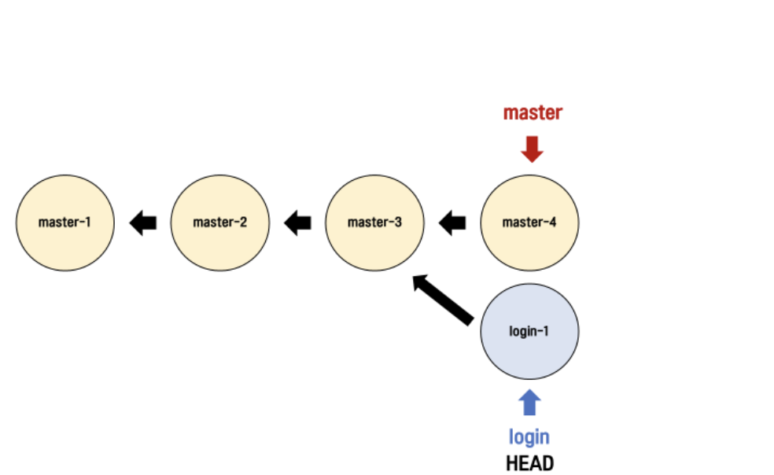

# Git hob 특강 3일차
## [1] Branch
> git에서 branch라는 개념은 매우 중요합니다.
### (1) Branch란?
- `나뭇가지`처럼 여러 갈래로 작업 공간을 나누어 <u>독립적으로 작업</u>할 수 있도록 도와주는 Git의 도구
- `장점`
    1. 독립공간을 형성하기 때문에 원본(master)에 대해 안전
    2. 하나의 작업은 하나의 브랜치로 나누어 진행되므로 체계적인 개발이 가능(merge하고 삭제, 작업할 게 생기면 다시 브랜치 생성)
    3. git브랜치를 만드는 속도가 굉장히 빠르고, 용량도 적음

- 그래도 브런치를 꼭 써야하나요?
    1. master 브랜치는 상용을 의미
    > 언제든 세상 공개되어 있음
    2. 즉, 고객들이 사용하고 있는데, 버전을 되돌리거나 삭제할 수 없음
    3. 따라서, 별도의 작업공간인 브랜치를 만들고, 그곳에서 되돌리거나 삭제를 함
    4. 그 이후에 에러를 해결했다면, 그 내용을 master에 반영!
    
### (2) git branch
> 브랜치 `조회, 생성, 삭제` 등 브랜치와 관련된 Git 명령어
```bash
# 브랜치 목록 확인
git branch

# 원격 저장소의 브랜치 목록 확인
git branch -r

# 새로운 브랜치 생성
git branch 브랜치 이름

# 특정 커밋 기준으로 브랜치 생성 
git branch 브랜치이름 커밋ID

# 특정 브랜치 생성
git branch -d 브랜치이름 # 병합된 브랜치만 삭제 가능
git branch -D 브랜치이름 # 강제 삭제(병합되지 않은 브랜치도 삭제 가능)
```

### (3) git switch
> 현재 브랜치에서 다른 브랜치로 `HEAD`를 이동시키는 명령어 
`HEAD`란 현재 브랜치를 가리키는 포인터를 말합니다. (즉, 브랜치 이동)
```bash
# 다른 브랜치로 이동
git switch 다른브랜치이름
# 브랜치를 새로 생성과 동시에 이동
git switch -c 브랜치이름
# 특정 커밋 기준으로 브랜치 생성과 동시에 이동
git switch -c 브랜치이름 커밋ID
```

# git switch하기 전에, 워킹 디렉토리 파일이 모두 버전관리가 되고 있나요?

master 브랜치와 feature브랜치가 있다고 가정
feature 브랜치에서 test.txt를 만들고 git add하지 않은 상태(즉, w.d)에서 `git switch master`를 하면 어떤 일이 발생할까요?

>바로! feature 브랜치에서 만들었던 test.txt가 master브랜치에도 똑같이 생성됩니다.

***왜 그럴까요?***
Git의 브랜치는 독립적인 작업공간을 가지지만, 어디까지나 Git이 관리하는 파일트리에 한해서 입니다.

git add를 하지 않은, 즉 staging area에 한번도 올라가지 않은 새 파일은 git의 버전 관리를 받고 있지 않기 때문에 브랜치가 바뀌더라도 (w.d에) 계속 유지되는 것입니다.

따라서 반드시 git switch를 하기 전에는 모든 워킹 디렉토리의 파일이 버전 관리가 되고 있는지 확인해야 합니다.
(그게 아니면 master 브랜치에도 적용되기 때문)

### [2] Branch scenario
> git branch와 git switch를 통해 브랜치를 `조회,생성,이동`하는 실습을 진행합니다.
### (1) 사전세팅
1. 홈 디렉토리에 `git-branch-practice` 폴더를 생성하고 이동 후 vscode를 엽니다.
```bash
mkdir git-brach-practice
cd git-branch-practice
code .
```
2. git 저장소를 생성합니다.
```bash
git init
```
3. `test.txt`를 생성하고 각각 `master-1, master-2,master-3`이라는 내용을 순서대로 입력하여 커밋3개를 작성합니다.
```bash
touch test.txt
git add . 
git commit -m "master-1" #3번 반복해서 커밋 3개 작성
```
4. `git log --oneline`을 입력했을 때 아래와 같이 나와야 정상입니다.
총 3개의 버전이 master브랜치에 만들어졌습니다.
```bash
git log --oneline
0604dcd (HEAD -> master) master-3
9c22c89 master-2
3d71510 master-1
```

### (2) 브랜치 생성, 조회
1. 현재 위치(master)에서 `login`이라는 이름의 브랜치를 생성합니다.
```bash
git branch login
```
2. login브랜치가 잘 생성되었는지 확인합니다.
```bash
git branch
  login
 *master
 ```
 3. `git log --oneline`을 입력했을 떄 아래와 같이 나와야 정상입니다.
 `0605dcd` 커밋 기준으로 `master` 와 `login`브랜치가 위치한 것을 볼 수 있습니다.
 ```bash
 git log --oneline
 0604dcd (HEAD -> master, login) master-3
 9c22c89 master-2
 3d71510 master-1
```
4. `master` 브랜치에서 1개의 커밋을 더 작성합니다.
```bash
test.txt에 master-4작성
git add .
git commit -m "master-4"

### (3) 브랜치 이동
1. 현재 브랜치와 커밋의 상태는 다음과 같습니다.
```bash
git log --oneline
5ca7701 (HEAD -> master) master-4
0604dcd (login) master-3
9c22c89 master-2
3d71510 master-1
```
2. 이때 `login` 브랜치로 이동하면?
```bash
git switch login
```
`master브랜치의 test.txt에 작성한 master-4가 지워졌습니다.`
```bash
# login브랜치의 test.txt
master-1
master-2
master-3
```
3. 그리고 `git log --oneline`을 입력하면 아래와 같이 나타납니다.
이제 `head`는 `login` 브랜치를 가리키고, `master`브랜치가 보이지 않습니다.
```bash 
git log --oneline
0004dcd (HEAD -> login) master-3
9c22c89 master-2
3d71510 master-1
```
4. master 브랜치는 삭제된 걸까요?
`아닙니다!` 브랜치를 조회해보면 다음과 같이 나타납니다.
HEAD가 `login` 브랜치를 가리키면서, ,log도 `login`브랜치 기준으로 보이는 것
```bash
git branch
*login
master
5. `git log --oneline --all`을 입력하면 모든 브랜치의 로그를 볼 수 있습니다.
```bash
git log --oneline --all
5ca7701 (master) master-4
0604dcd (HEAD -> login) master-3
9c22c89 master-2
3d71510 master-1
```

즉 브랜치를 이동한다는건 HEAD가 해당 브랜치를 가리킨다는 것을 의미하고
브랜치는 최신 커밋을 가리키므로, HEAD가 해당 브랜치의 `최신 커밋`을 가리키게 됩니다.

따라서 **워킹 디렉토리의 내용도 HEAD가 가리키는 브랜치의 최신 커밋 상태로 변화**합니다

### (4) login 브랜치에서 커밋 생성
1. `test.txt`파일에 `login-1`이라고 작성합니다.
```bash
# login 브랜치의 test.txt
master-1
master-2
master-3
login-1
```
2. 추가적으로 `test_login.txt`도 생성하고 login-1이라고 작성해봅시다.
```bash
touch test_login.txt
#이후 test_login.txt에 작성
login-1
```
3.커밋을 생성합니다.
```bash
git add .
git commit -m "login -1"
```
4. `git log -oneline --all --graph`를 통해 아래와 같은 내용을 확인합니다.
`master`브랜치와 `login`브랜치가 다른 갈래로 갈라진 것을 확인할 수 있습니다.
```bash
$ git log --oneline --graph --all
* 3b0a091 (HEAD -> login) login-1
| * 5ca7701 (master) master-4
|/
* 0604dcd master-3
* 9c22c89 master-2
* 3d71510 master-1
```


